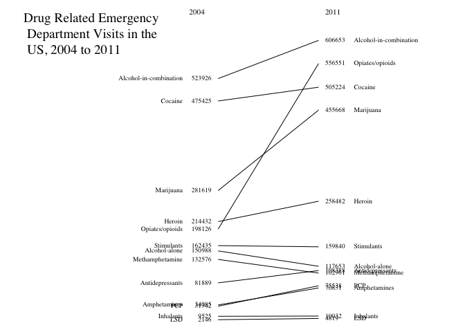

Part 1:Slopegraph -Drug Related Emergency Department Visits in the US, 2004 to 2011
================
Erin Hutcheson
February 25, 2018

### source: <https://www.samhsa.gov/data/emergency-department-data-dawn/reports>

### data: National Estimates of Drug-Related Emergency Department Visits, 2004-2011 - All Misuse and Abuse

``` r
library(dplyr)
```

    ## 
    ## Attaching package: 'dplyr'

    ## The following objects are masked from 'package:stats':
    ## 
    ##     filter, lag

    ## The following objects are masked from 'package:base':
    ## 
    ##     intersect, setdiff, setequal, union

### 1. Wrangling the data

``` r
setwd("/Users/erinhutcheson/Desktop/r1")

# The file starts with 6 blank rows before the header, so when loading it, I utilize the command "skip = 5" in order to delete the rows.  Also, in place of NA this file uses *.   I am replacing * with NA

emergencyroom <- read.csv("EmergencyRoom.csv", skip=6, na.strings = c("*"), header=TRUE,  stringsAsFactors=FALSE, sep=",", colClasses=c("Drugs"="character"))


#There are 578 observations.  Due to this, in the following command, I simplify the data by only keeping some of the observations

ER <- emergencyroom %>%
  select ("Drugs", "Estimates.2004", "Estimates.2011") %>%
  filter (Drugs %in% c("Alcohol-alone", "Cocaine", "Heroin", "Marijuana", "Stimulants", "Amphetamines",    
  "Methamphetamine", "LSD", "PCP", "Inhalants", "Antidepressants", "Opiates/opioids", "Alcohol-in-combination"))
```

### 2. Ensuring that the data is numeric

``` r
write.csv(ER, "ER.csv")

ER <- readr::read_csv("ER.csv")
```

    ## Warning: Missing column names filled in: 'X1' [1]

    ## Parsed with column specification:
    ## cols(
    ##   X1 = col_integer(),
    ##   Drugs = col_character(),
    ##   Estimates.2004 = col_number(),
    ##   Estimates.2011 = col_number()
    ## )

### 3. Creating a Slopegraph that shows the change of drug related emergency department visits in the US from 2004 to 2011 based on drug type

``` r
# Creating a slopegraph with the observations I kept.

x0 <- c()
y0 <- c()
x1 <- c()
y1 <- c()

startyear <- 2004
stopyear <- 2011
xoffset <- 2
yoffset <- 0
ystartprev <- 0
ystopprev <- 0
ythreshold <- (max(ER$`Estimates.2004`) - min(ER$`Estimates.2004`)) * 0.025
for (i in length(ER$Drugs):1) {
  vals <- ER[i, ]

  ystartdiff <- (vals$`Estimates.2004` + yoffset) - ystartprev
  if (abs(ystartdiff) < ythreshold) {
    yoffset <- yoffset + (ythreshold - ystartdiff)
  }

  # Calculate slope
  slope <- (vals$`Estimates.2011` - vals$`Estimates.2004`) / (stopyear - startyear)

  # Intercept
  intercept <- vals$`Estimates.2004` + yoffset

  # Start and stop coordinates for lines
  ystart <- intercept
  ystop <- slope * (stopyear - startyear) + intercept
  ystopdiff <- ystop - ystopprev
  if (abs(ystopdiff) < ythreshold) {
    yoffset <- yoffset + (ythreshold - ystopdiff)
    intercept <- vals$`Estimates 2004` + yoffset
    ystart <- intercept
    ystop <- slope * (stopyear - startyear) + intercept
  }

  # Draw the line for current country
  x0 <- c(x0, startyear)
  y0 <- c(y0, ystart)
  x1 <- c(x1, stopyear)
  y1 <- c(y1, ystop)


  ystartprev <- ystart
  ystopprev <- ystop
}

ymin <- min(ER$`Estimates.2004`)
ymax <- max(c(ER$`Estimates.2004`, ER$`Estimates.2011`)) + yoffset

par(family = "serif", mar = c(0, 0, 0, 0))
plot(0, 0, type = "n", main = "", xlab = "", ylab = "", xlim = c(1990, 2020), ylim = c(ymin, ymax * 1.1), bty = "n", las = 1, axes = FALSE)
segments(x0, y0, x1, y1)
text(x0, y0, rev(ER$`Estimates.2004`), pos = 2, cex = 0.6)
text(x0 - xoffset, y0, rev(ER$Drugs), pos = 2, cex = 0.6)
text(x1, y1, rev(ER$`Estimates.2011`), pos = 4, cex = 0.6)
text(x1 + xoffset, y1, rev(ER$Drugs), pos = 4, cex = 0.6)

# Title
text(1990, ymax * 1.00, "Drug Related Emergency \n Department Visits in the \n US, 2004 to 2011", cex = 1.2, pos = 4.0)


# Year labels
text(startyear, ymax * 1.1, "2004", cex = 0.7, pos = 2, offset = 1)
text(stopyear, ymax * 1.1, "2011", cex = 0.7, pos = 4, offset = 0.5)
```


